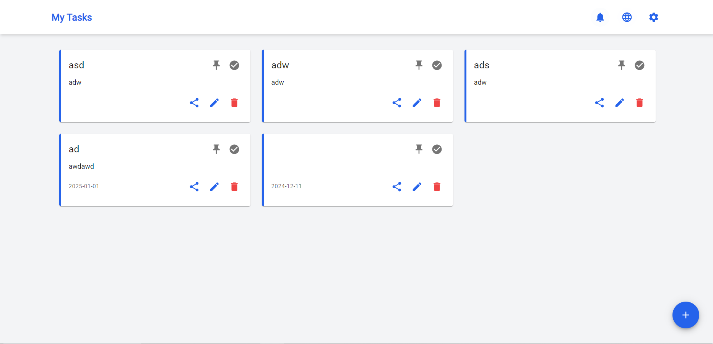

# Task Manager Application

## Description
A modern task manager application that allows users to manage their tasks efficiently. The application features user authentication, task management, and a user-friendly interface built with React and Tailwind CSS.

## Features
- User authentication (login and registration)
- Task creation, editing, and deletion
- Responsive design
- Internationalization support
- Animated UI components

## Technologies Used
### Backend
- **Node.js**: JavaScript runtime for building the server.
- **Express**: Web framework for building APIs.
- **SQLite**: Lightweight database for storing user and task data.
- **JWT**: For secure user authentication.
- **Bcrypt**: For password hashing.

### Frontend
- **React**: JavaScript library for building user interfaces.
- **Tailwind CSS**: Utility-first CSS framework for styling.
- **Material UI**: React components for faster and easier web development.
- **Framer Motion**: For animations and transitions.
- **i18next**: For internationalization support.

## Folder Structure
```
task-manager-website/
├── backend/
│   ├── db.js
│   ├── package.json
│   ├── server.js
│   └── routes/
│       ├── auth.js
│       └── tasks.js
└── frontend/
    ├── public/
    ├── src/
    │   ├── components/
    │   ├── pages/
    │   ├── App.js
    │   └── index.js
    └── package.json
```

## Contributing
Contributions are welcome! Please open an issue or submit a pull request for any improvements or features.

## Demo
http://x.xtr.lol:85

## Preview



## Internationalization Support
The application supports both Farsi and English languages. Users can switch between languages seamlessly, allowing for a more inclusive experience. The internationalization is handled using the `i18next` library, which provides a robust framework for managing translations and language switching.

## License
This project is licensed under the MIT License.
